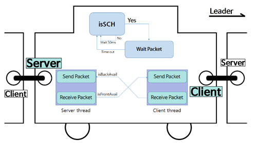

# Connected Car Group Driving

## Paper : Reserve Group Based Group Fragmentation Method for Reliable Connected Car Application(KICS 2017)

## Installation in Raspberry Pi 3 Model B

1. Setup Ad-hoc mode

	1-1 On each node, open /etc/network/interfaces in a text editor: 
	
		#sudo nano /etc/network/interfaces
		
	1-2 Define stanzas for each node's wireless interface, setting the network SSID and the device's operating mode to ad-hoc:
	
		Node A
			auto wlan0
			iface wlan0 inet static
				address 192.168.1.1
				netmask 255.255.255.0
				wireless-channel 1
				wireless-essid MYNETWORK
				wireless-mode ad-hoc
		
		Node B
			auto wlan0
			iface wlan0 inet static
				address 192.168.1.2
				netmask 255.255.255.0
				wireless-channel 1
				wireless-essid MYNETWORK
				wireless-mode ad-hoc
				
	1-3 Save the file and exit the editor
		
	1-4 Raise the interface on each node:
	
		#sudo reboot
			
	1-5 Enter Network Settings:
	
		(1) Click the Network Settings
		(2) Enter the Edit Connections
		(3) Uncheck autofill
		(4) Write the ip address in ip black
			
	1-6 To test, ping node A from node B:
	
		#ping 192.168.1.1
		
2. Setting Server time. Use opensource ntpdate

	NTP(Network Time Protocol):
		
		Network Time Protocol(NTP) is a networking protocol for clock synchronization between computer systems over packet-switched, variable-latency data networks.
			
	2-1 Install ntpdate:
			
		#sudo apt-get install ntpdate
			
	2-2 Finding you want server website. If you find website, you wrtie the code:
	
		#sudo ntpdate -u 3.kr.pool.ntp.org
	
	2-3 To test, write current time command:
	
		#date
		
## System Architecture

Each two cars connect each other. Using Server-Client socket.

Data flow:

	1. Group leader sends a path request message to all group members.
	2. If all group members receive a path request message from group leader, they send a path reply message to group leader.
	3. If group leader receive all path reply message from group member, group leader execute the subgroup generation algorithm.
	4. After the algorithm, group leader sends the group align information to all group members.
	5. If all group members receive the group align information, they send acknowlege message to group leader.

## Execute Process

Compile Code:

	#gcc -o ConnectedCar ConnectedCar.c

Execute Program:

	Group Leader
	   #./ConnectedCar -L [FrontIp] [myCarId] [PortNumber]
   
	Group member
	   #./ConnectedCar [FrontIp] [myCarId] [PortNumber]

## License

MIT

## Author

Kyungpook National University:

	Eunho Son
	Munju Jeong
	Hyunha Jeon
	Myeongjun Kim
